# pemketir - sentiment analysis

[](https://hits.seeyoufarm.com)

- https://github.com/arisros/pemketir

## prerequisites
- php 8.3.13 (mylocal)
- mysql (8.3.0)
- terminal
- [mycli](screenshots/https://github.com/dbcli/mycli) to work with mysql

### setup alert
https://www.google.com/alerts
- pilih topik ("POLITIK")
- akan muncul "show options" lalu klik
  - at most once a day
  - news
  - indonesia
  - indonesia
  - only the best results
  - rss feed
- buat -> create alert button klik
- klik icon RSS
- simpan link pada URL browser (copy - paste bebas mao taro dimana)
- (slangcsv)[https://github.com/adeariniputri/text-preprocesing/blob/master/slang.csv] 

### setup db

sesuai dalam doc materi
- db_pemketir
  - galert_data
  - galert_entry
  - kategori (unused by now)

login db
```
mysql -u {USERNAME_DB} -p {PASSWORD_DB}
```
database
```
CREATE DATABASE db_pemketir;
```

masuk db yang baru dibuat
```
use db_pemketir;
```

table `galert_data`
```
CREATE TABLE galert_data (
	galert_id VARCHAR(300) NOT NULL DEFAULT '',
	galert_title TINYTEXT NULL DEFAULT NULL,
	galert_link TINYTEXT NULL DEFAULT NULL,
	galert_update TINYTEXT NULL DEFAULT NULL,
	PRIMARY KEY (galert_id)
);
```

table `galert_entry`
```
CREATE TABLE galert_entry (
	entry_id VARCHAR(300) NOT NULL,
	entry_title TINYTEXT NOT NULL,
	entry_link TINYTEXT NOT NULL,
	entry_published TINYTEXT NOT NULL,
	entry_updated TINYTEXT NOT NULL,
	entry_content TINYTEXT NOT NULL,
	entry_author TINYTEXT NOT NULL,
	feed_id VARCHAR(300) NOT NULL DEFAULT '',
	PRIMARY KEY (entry_id)
);
```


table `kategori`
```
CREATE TABLE kategori (
	id_kategori int(11) unsigned NOT NULL auto_increment, nm_kategori varchar(50) NOT NULL default '',     
   PRIMARY KEY  (id_kategori)
);
```

table `slangword`
```
CREATE TABLE slangword (
k_tbaku VARCHAR(50) NOT NULL,
k_baku VARCHAR(100) NOT NULL
);
```

table `preprocessing`
```
CREATE TABLE preprocessing (
entry_id VARCHAR(300) NOT NULL,
p_cf TINYTEXT NOT NULL,
p_simbol TINYTEXT NOT NULL,
p_sword TINYTEXT NOT NULL,
p_stopword TINYTEXT NOT NULL,
p_stemming TINYTEXT NOT NULL,
p_tokenisasi TINYTEXT NOT NULL,
data_bersih TINYTEXT NOT NULL,
PRIMARY KEY (entry_id)
);
```

table `P_Data`
```
CREATE TABLE P_Data (
kata VARCHAR(100) NOT NULL,
id_kategori Int(11) NOT NULL,
jml_data Int(11) NULL DEFAULT 0,
nilai float(10,10) NULL DEFAULT 0
);
```

inject slang to `slangword` table (please change with yours)
```
LOAD DATA INFILE './pemketir/resources/slang.csv'
INTO TABLE slangword
FIELDS TERMINATED BY ','
ENCLOSED BY ''
LINES TERMINATED BY '\n'
IGNORE 1 ROWS
(k_tbaku,k_baku);
```

```
CREATE TABLE P_Kategori (
id_kategori Int(11) NOT NULL,
jml_data Int(11) NULL DEFAULT 0,
nilai float(10,10) NULL DEFAULT 0,
tmp_nilai float(10,10) NULL,
PRIMARY KEY (id_kategori)
);
```

```
CREATE TABLE classify (
data_bersih TINYTEXT NOT NULL,
id_actual VARCHAR(3) NULL,
id_predicted VARCHAR(3) NULL
)
```

***notes: tested with fullpath***
ex: /usr/pemketir/resources/slang.csv


## serve project
```
php -S localhost:{port}
```

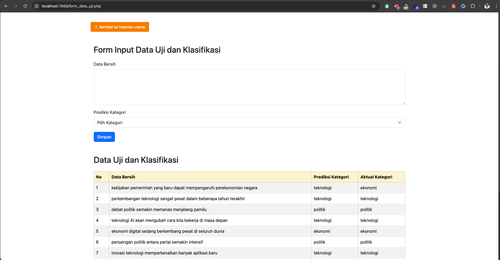
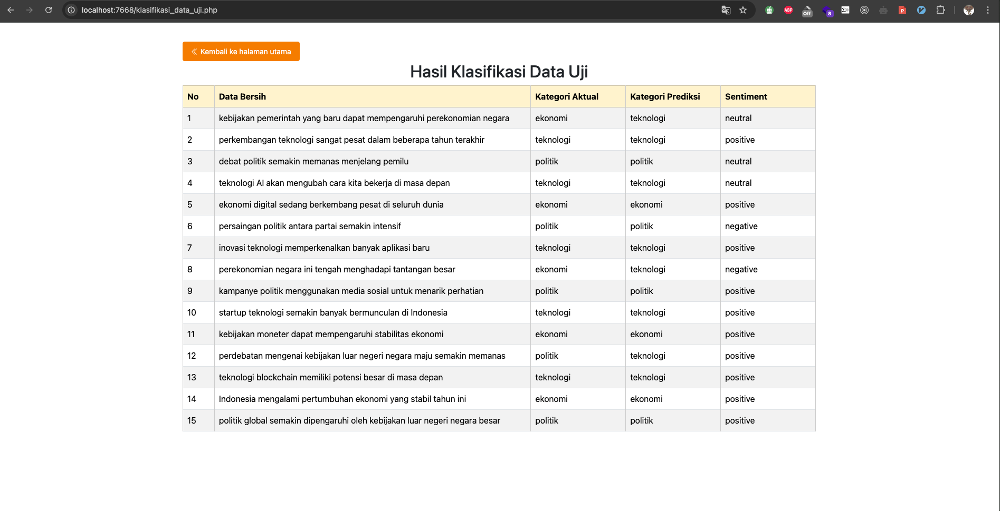
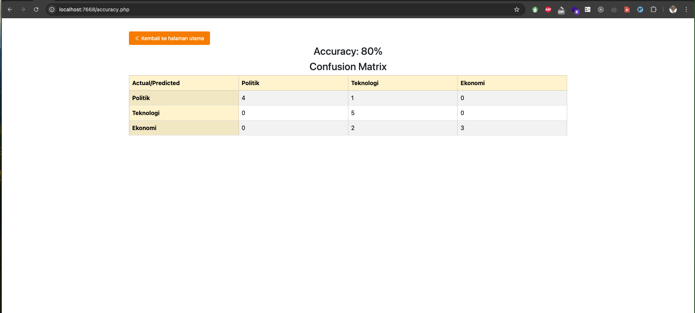
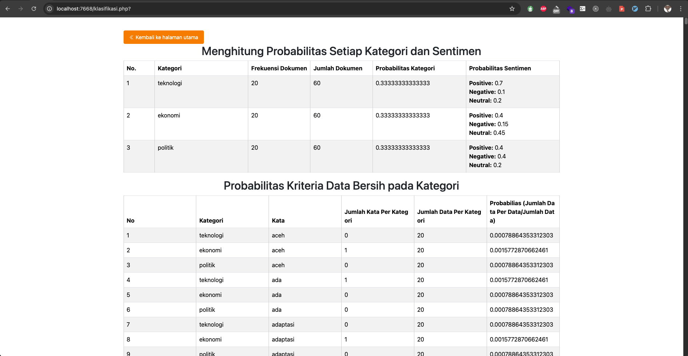
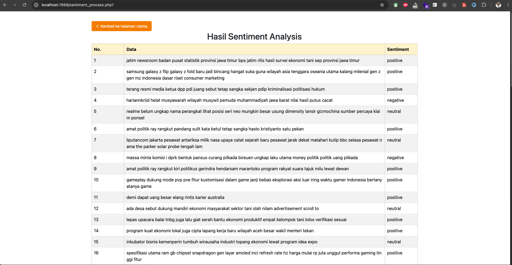
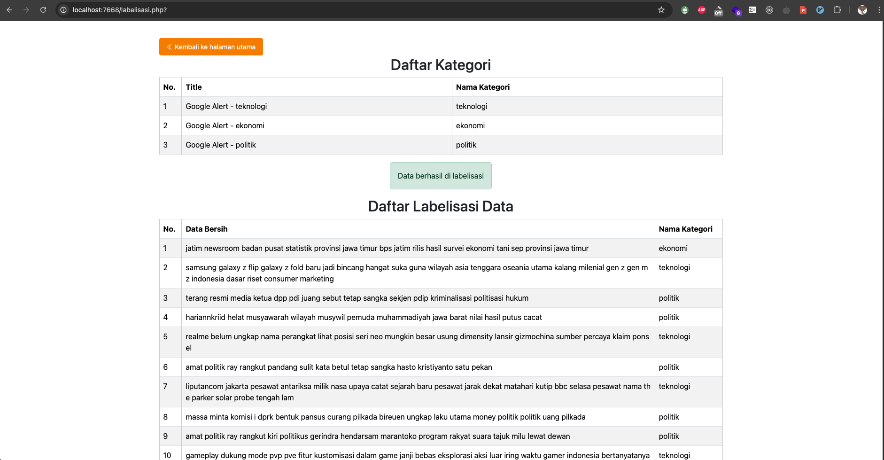
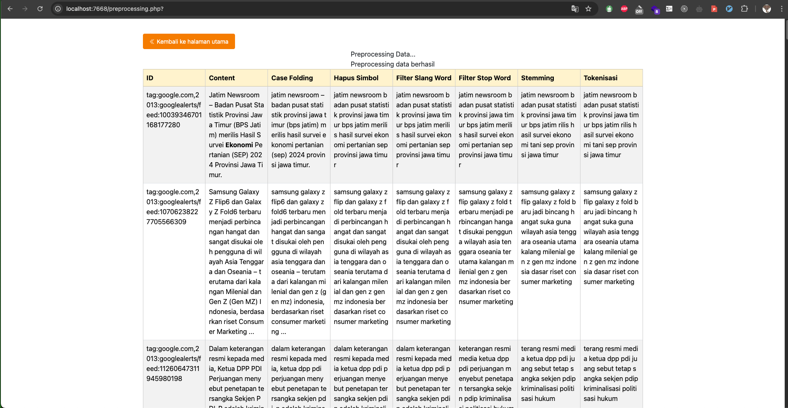
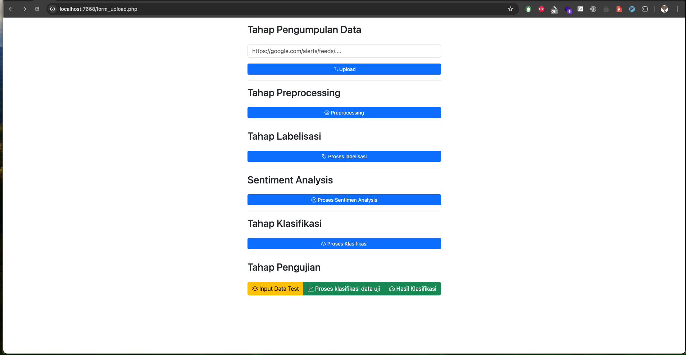
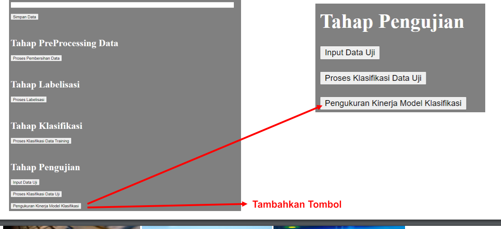


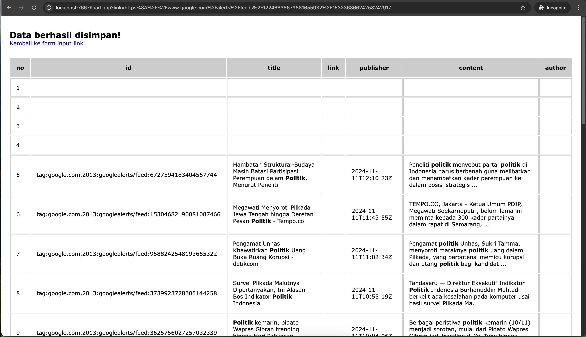
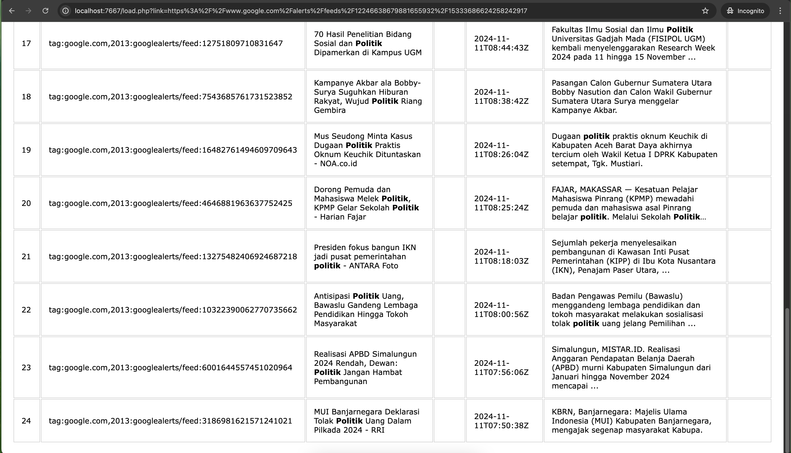

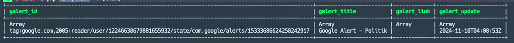
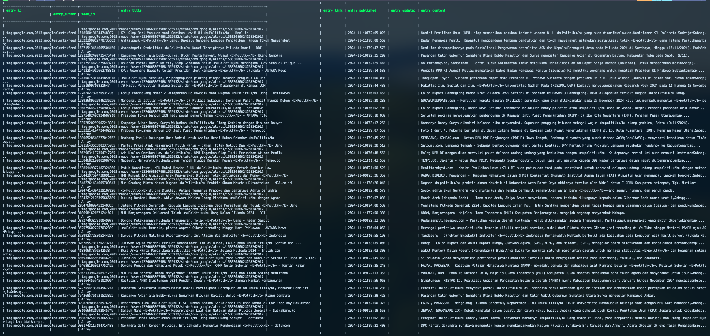

**Preprocessing**
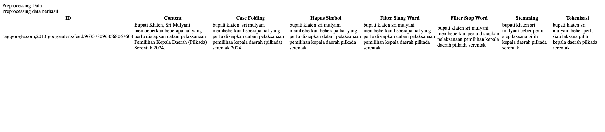